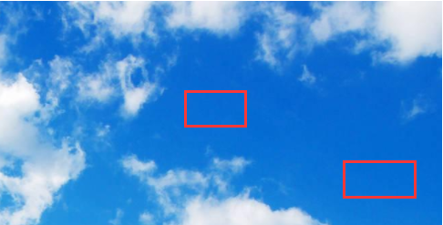
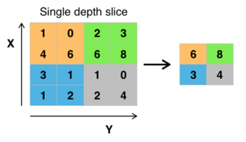

# 卷积神经网络

## 一、概念

卷积神经网络（Convolutional Neural Network, CNN）是一种前馈神经网络，对于大型图像处理能够有出色表现。

> 我将慢慢揭开``CNN``的神秘面纱，然后会发现，其实也挺简单的哈!   ~_~~

## 二、介绍

### 2.1 简单神经网络单元

- 神经元

    一个简单的神经网络单元结构如下：

    

    用公式表达：

    

    > 此公式中需要注意的是：bias 为一个常量 --- 一个神经单元只有一个bias 

    熟悉监督学习的小伙伴就会发现，此公式与Logistic回归模型公式很类似。请思考五秒......

    发散思维：每个神经单元都是由各种基础监督、非监督学习算法组成以及其它高级算法组合而成，很多个小算法组合起来就能解决更加复杂的问题。

- 神经网络层

    当多个神经元联合组成分层结构，就形成了神经网络，如下为只有一个隐藏层的简单神经网络：

    

    > Layer L1为输入层，Layer L2为隐藏层，Layer L3为输出层

    神经网络和监督学习的训练方法大同小异，只不过其结构相对复杂而已，一般采用梯度下降+链式求导法则，专业术语就是**反向传播**。

### 2.2 卷积神经网络 - 卷积层

- 什么是卷积

    已有paper和大牛解释过，我就不在赘述，直接奉上我的膝盖：[对卷积神经网络直观的解释](https://www.zhihu.com/question/39022858/answer/224446917)

- 场景引入

    为了更加形象的描述接下来的几个问题，我将引入以下场景：

    假如有一个``1000*1000``的图像，那么输入层就是``1000000``维度，如果隐含层和输入层维度一样，而且还是全连接，那么根据以上对普通神经元的介绍中，参数个数就是：``1000000*1000000=10^12``，有木有感觉很可怕，这么多参数根本没法训练，就算有足够的的数据，也很难训练到位，所以就需要以下方法。

- 局部感知

    为了减少参数个数，于是就诞生了局部感知器。少废话，先看图：

    

    左边就是每个神经单元都需要扫描整张图，所以需要``10^12``个参数；右边是每个神经单元只需要负责图片中的部分位置，假如每个神经元只需要负责``10*10``大小区域，卷积核大小为(1,1)，如此，输入层和隐藏层的参数个数就为``1000000*100=10^8``(此时的``1000000``为隐藏层的神经元数量，``100``为每个神经元对应的参数数量)，这样参数个数就减少为原来的万分之一。

    有木有很棒，然而，``10^8``个参数还是太多了。 

- 参数共享

    为了进一步减少参数数量，于是就需要有**权值共享**。

    如何理解参数共享呢，我举几个栗子：

    栗子一：假如以上``1000000``个神经元训练出来的特征都是一样的，也就是每个神经元的``100``个参数都相同，那么根据参数共享机制，所有神经元都共享同一套参数：``100``,所以总共参数就只有100个了。

    栗子二：假如以上1000000个神经元训练出10000个特征，那么其中就有很多神经元训练的特征都是相同的，此时相同特征的神经元之间就需要共享同一套参数，那么就只需要有10000套参数，总共参数个数为：10000*100=10^6个。

    看了上面的讲解是不是形象很多呢，那么接下来就看看我一本正经的看图说话吧：

    每个神经元都相当于提取一个特征，与方式和位置无关，极大可能性某个神经元提取的特征与在图像另外一个位置上提取的特征一模一样，比如以下图片：

    

    图中所标识的两个位置对应统计的特征是一样的，所以参数是共享的。

    那么每个神经元到底是怎么做卷积的呢？看下图：

    

    > 此卷积神经元对应扫描图片中5*5大小区域，卷积核大小为3*3，右边就是对应提取的区域特征。

### 2.3 卷积神经网络 - 池化层

池化(`Pooling`)是卷积神经网络中另一个重要的概念，它实际上是一种形式的降采样。有多种不同形式的非线性池化函数，而其中“最大池化（`Max pooling`，如下图所示）”是最为常见的。它是将输入的图像划分为若干个矩形区域，对每个子区域输出最大值。直觉上，这种机制能够有效地原因在于，在发现一个特征之后，它的精确位置远不及它和其他特征的相对位置的关系重要。池化层会不断地减小数据的空间大小，因此参数的数量和计算量也会下降，这在一定程度上也控制了过拟合。通常来说，CNN的卷积层之间都会周期性地插入池化层。

池化层通常会分别作用于每个输入的特征并减小其大小。目前最常用形式的池化层是每隔2个元素从图像划分出 `2*2`的区块，然后对每个区块中的4个数取最大值。这将会减少75%的数据量。

除了最大池化之外，池化层也可以使用其他池化函数，例如“平均池化”甚至“L2-范数池化”等。过去，平均池化的使用曾经较为广泛，但是最近由于最大池化在实践中的表现更好，平均池化已经不太常用。

由于池化层过快地减少了数据的大小，目前文献中的趋势是使用较小的池化滤镜，甚至不再使用池化层。

### 2.4 线性整流层

线性整流层（Rectified Linear Units layer, ReLU layer）使用线性整流（Rectified Linear Units, ReLU）作为这一层的激励函数（Activation function），它可以增强判定函数和整个神经网络的非线性特性---给卷积结果做非线性变换，而本身并不会改变卷积层。

> 以上是卷积神经网络层中优化算法，我们不需要手动实现，只需要调整参数改变对应策略就行。

## 三、多层神经网络

### 3.1 ImageNet-2010 网络结构

***

参考链接
- [wiki-卷积神经网络](https://zh.wikipedia.org/wiki/%E5%8D%B7%E7%A7%AF%E7%A5%9E%E7%BB%8F%E7%BD%91%E7%BB%9C#cite_note-deeplearning-1)

- [cs231n-Convolutional Neural Networks](http://cs231n.github.io/convolutional-networks/)

- [卷积神经网络](https://blog.csdn.net/stdcoutzyx/article/details/41596663)
