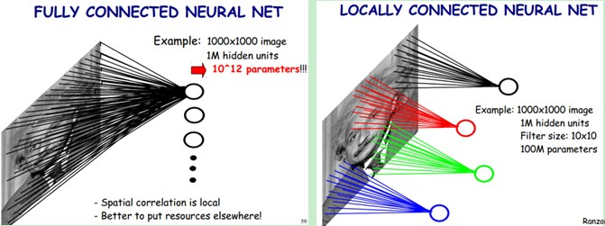
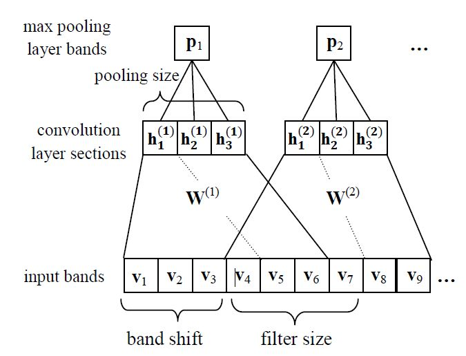

# 卷积原理是案例

## 一、概念

卷积神经网络（Convolutional Neural Network, CNN）是一种前馈神经网络，对于大型图像处理能够有出色表现。

> 在以前学习监督学习和非监督学习算法的时候，认为``CNN``、``RNN``等神经网络结构是很了不起的知识，现在看来也只是另外一种算法的实现而已，就类似于监督学习中的``SVM``、``DecisionTree``，也可以看作一个分类器，不过用神经网络结构来实现能够更加高效简单。

## 二、介绍

### 2.1 简单神经网络单元

- 单个神经元

    一个简单的神经网络单元结构如下：

    

    用公式表达：

    

    熟悉监督学习的小伙伴就会发现，此公式与Logistic回归模型公式很类似。请思考五秒......

    对没错，监督学习算法可以用简单的神经元来实现。那么扩散一下，监督学习和非监督学习中的各类算法其实都可以用不同的神经网络来实现，而且在编码上来讲要更简单，更简单，更简单。

- 神经网络层

    当多个神经元联合组成分层结构，就形成了网络结构，一个简单的包含一层隐藏层网络结构如下：

    

    > Layer L1为输入层，Layer L2为隐藏层，Layer L3为输出层

    神经网络的训练方法和监督学习简单算法中大同小异，只不过其结构相对复杂而已，一般采用梯度下降+链式求导法则，专业术语就是**反向传播**。

### 2.2 卷积神经网络 - 卷积层

- 什么是卷积

    已有paper和大牛解释过，我就不在赘述，直接奉上我的膝盖：[对卷积神经网络直观的解释](https://www.zhihu.com/question/39022858/answer/224446917)

    假如有一个``1000*1000``的图像，那么输入层就是``1000000``维度，如果隐含层和输入层维度一样，而且还是全连接，那么根据以上对普通神经元的介绍中，参数个数就是：``1000000*1000000=10^12``，有木有感觉很可怕，这么多参数根本没法训练，就算有足够的的数据，也很难训练到位，所以就需要以下方法。

- 局部感知

    为了减少参数个数，于是就诞生了局部感知器。少废话，先看图：

    

    左边就是每个神经单元都需要扫描整张图，所以需要``10^12``个参数；右边是每个神经单元只需要负责图片中的部分位置，假如每个神经元只需要负责``10*10``大小区域，卷积核大小为(1,1)，如此，输入层和隐藏层的参数个数就为``1000000*100=10^8``(此时的``1000000``为隐藏层的神经元数量，``100``为每个神经元对应的参数数量)，这样参数个数就减少为原来的万分之一。

    > 这里只是为了举例子，描述一个特殊情况，在此声明一下：神经元的个数一般需要自行指定，卷积神经网络将会自行计算每个神经元对应扫描位置以及大小，而且都是有一定的交集的，不可能像上文中所描述的为紧密相邻，毫无交集，所以在此处需要注意一下。有一个形象的图片为：

    

    有木有很棒，然而，``10^8``个参数还是太多了。

    

- 参数共享

    为了进一步减少参数数量，于是就需要有**权值共享**。

    如何理解参数共享呢，我举几个栗子：

    栗子一：假如以上``1000000``个神经元训练出来的特征都是一样的，也就是每个神经元的``100``个参数都相同，那么根据参数共享机制，所有神经元都共享同一套参数：``100``,所以总共参数就只有100个了。

    栗子二：假如以上1000000个神经元训练出10000个特征，那么其中就有很多神经元训练的特征都是相同的，此时相同特征的神经元之间就需要共享同一套参数，那么就只需要有10000套参数，总共参数个数为：10000*100=10^6个。

    看了上面的讲解是不是形象很多呢，那么接下来就看看我一本正经的看图说话吧：

    每个神经元都相当于提取一个特征，与方式和位置无关，极大可能性某个神经元提取的特征与在图像另外一个位置上提取的特征一模一样，比如以下图片：

    

    图中所标识的两个位置对应统计的特征是一样的，所以参数是共享的。

    那么每个神经元到底是怎么做卷积的呢？看下图：

    

    > 此卷积神经元对应扫描图片中5*5大小区域，卷积核大小为3*3，右边就是对应提取的区域特征。

### 2.3 卷积神经网络 - 池化层

> 以上是卷积神经网络层中优化算法，我们不需要手动实现，只需要调整参数改变对应策略就行。

***

参考链接
- [wiki-卷积神经网络](https://zh.wikipedia.org/wiki/%E5%8D%B7%E7%A7%AF%E7%A5%9E%E7%BB%8F%E7%BD%91%E7%BB%9C#cite_note-deeplearning-1)

- [cs231n-Convolutional Neural Networks](http://cs231n.github.io/convolutional-networks/)

- [卷积神经网络](https://blog.csdn.net/stdcoutzyx/article/details/41596663)
