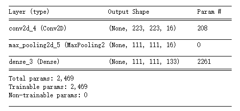

# 怎么计算卷积层中对应参数个数？

这段时间在用Keras搭建卷积神经网络中，发现Keras可以自行计算出每层中对应参数的数量，对此我比较好奇，于是做了以下计算：

## 2.1 问题环境描述

有一张224*224大小的图片，第一层就为卷基层，代码如下：

```python
from keras.layers import Conv2D, MaxPooling2D, GlobalAveragePooling2D
from keras.layers import Dropout, Flatten, Dense
from keras.models import Sequential

model = Sequential()

## TODO: 定义你的网络架构
print(np.array(train_tensors).shape)
model.add(Conv2D(16,(2,2),input_shape=(224,224,3)))
model.add(MaxPooling2D(pool_size=(2,2)))
model.add(Dense(133))
model.summary()
```

最终统计结果如下：




> 这里先抛出卷积层中卷积核操作动态图：


## 2.2 第一个层（卷积层）的参数个数计算

先整理以下此环境中对应的数据信息

- 信息列表
    - Filter个数：32
    - 原始图像shape：224*224*3
    - 卷积核大小为：2*2

- 先倒推

    第一层整个参数个数为：208，Filter（卷积核）个数为16，所以每个Filter对应的参数个数为：208/16=13。

    加入每个Filter对应区域都是紧密相邻，平均规划，所以每个Filter对应局部区域大小为：224/16=14。

    然后卷积核大小为(2*2)，14-2+1=13，咦~~乍一看貌似是对的啊，可是每个卷积核对应的参数个数应该是：(14-2+1)*(14-2+1)=13*13。那么最终所有Filter对应的参数应该是13*13*16 = 208*13 个，而不是208个。

    

    这就很尴尬了，不知道是不是我哪里计算出错了！

    请各位大神指教！
    
