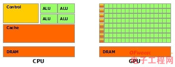

# 计算机视觉从入门到放肆

## 一、基础知识
1.1 计算机视觉到底是什么？

**计算机视觉是一门研究如何让机器“看”的科学**

更进一步的说，就是使用摄像机和电脑代替人眼对目标进行识别、跟踪和测量等机器视觉，并进一步做图形处理，使电脑处理成为更适合人眼观察或传送给仪器检测的图像。

作为一门科学学科，计算机视觉研究相关的理论和技术，视图建立能够从图像或者多维数据中获取'信息'的人工智能系统。

1.2 图像
当程序在读取一张图片时，需要考虑以下数据：

- 高度、宽度

    假如一张照片的分辨率为：1920*1080(单位为dpi，全称为 dot per inch)，1920 就是照片的宽度，1080 就是图片的高度。

- 深度

    存储每个像素所用的位数，比如正常RGB的深度就是 2^8 * 3 = 256 * 3 = 768 ， 那么此类图片中的深度为768，每个像素点都能够代表768中颜色。

- 通道数

    RGB图片就是有三通道，RGBA类图片就是有四通道

- 颜色格式

    是将某种颜色表现为数字形式的模型，或者说是一种记录图像颜色的方式。比较常见的有：RGB模式、RGBA模式、CMYK模式、位图模式、灰度模式、索引颜色模式、双色调模式和多通道模式。

- more 
    图像中的知识点太多，做基本图像处理，了解以上知识个人感觉可以了。等到以后如果做深入研究，或许有机会做更多的学习

1.3 视频

原始视频 = 图片序列，视频中的每张有序图片被称为“帧(frame)”。压缩后的视频，会采取各种算法减少数据的容量，其中IPB就是最常见的。
- 码率

    数据传输时单位时间传送的数据位数，通俗一点的理解就是取样率，单位时间取样率越大，精度就越高，即分辨率越高
- 帧率

    每秒传输的帧数，fps（有没有一种似曾相识的感觉~~~），全称为 frames per second
    
- 分辨率

    每帧图片的分辨率

- 清晰度

    平常看片中，有不同清晰度，实际上就对应着不同的分辨率

- IPB
    
    在网络视频流中，并不是把每一帧图片全部发送到客户端来展示，而是传输每一帧的差别数据（IPB），客户端然后对其进行解析，最终补充每一帧完整图片

1.4 摄像机

在实际应用当中，基本上都是通过不同种类的摄像机来获取数据，然后发送给服务端（AI Server）进行处理，分类有：

- 监控摄像机（网络摄像机和模拟摄像机）
- 行业摄像机（超快动态摄像机、红外摄像机、热成像摄像机等）
- 智能摄像机
- 工业摄像机

1.5 CPU和GPU

我想大家肯定是知道，目前很多人工智能计算都迁移到GPU上进行，tensorflow甚至还有cpu和gpu版本，所以其两者的差别和使用方法，这是绕不开的问题。

废话少说，先来上图：
- 架构上的对比

    

    - 绿色：计算单元
    - 橙红色：存储单元
    - 橙黄色：控制单元

- 整体对比

    

    - Cache、Local Memory ： CPU > GPU
    - Threads（线程数）：GPU > CPU
    - Registers（寄存器）：GPU > CPU 
    - SIMD Unit（单指令多数据流）：GPU > CPU

CPU在设计上，低延迟，可是低吞吐量，CPU的ALU（算数运算单元）虽然少，可是很强大，可以在很少的时钟周期内完成算数计算，或许数量少，就可以任性的减少时钟周期，其频率非常高，能够达到1.532 ~ 3 （千兆，10的9次方）

GPU在设计上，高延迟，可是高吞吐量。

1.* 计算机视觉的应用

计算机视觉之于未来人工智能，就好比眼睛之于人的重要性一样。是未来很多领域自动化获取数据的主要渠道之一，也是处理数据的重要工具之一。目前可以预想到的应用主要有如下：
- 无人驾驶
- 无人安防
- 人脸识别
- 文字识别
- 车辆车牌识别
- 以图搜图
- VR/AR
- 3D重构
- 医学图像分析
- 无人机
- more ......

## 二、推荐参考书和公开课

## 三、你还是需要学习一些深度学习知识

## 四、开源框架必不可少

## 五、深入，则必须阅读相关文献
