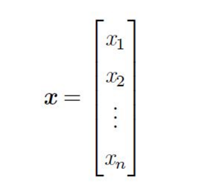

# 最好都能掌握的机器学习数学知识

## 一：概述

学习机器学习和深度学习中，有太多的理论公式推导，没有一定的数学基础是很难理解其意。从另外一个角度上看，数学是机器学习中一个最基础的工具，如果基础都没有打扎实，以后的路将很难走，更别说走远了。
好了，不废话了，请看以下学习清单：

> 事无巨细，我会从某个大方面介绍，其下所包含的额外知识点，请自行脑补，不然这篇文章将会把书籍目录上的知识点都给罗列出来。

## 二：线性代数

### 2.1 标量和向量

标量就是一个数值，不掺杂其它含义。

向量是有大小有方向的量，在这里就是一组有序数，并用以下符号表示：

在实际应用当中，向量通常被当做是高维空间的点，其中每个标量对应具体维度。

### 2.2 矩阵

在介绍矩阵时，我先推荐一款高分视频，这是国外大佬以动画的形式让我们明白，原来线性代数是这个样子的。 [链接](https://space.bilibili.com/88461692?spm_id_from=333.338.v_upinfo.3#/channel/detail?cid=9450)

- 基本运算
    
    对于基本运算，加法、减法、数乘、转置是需要有所了解的。

- 特征值和特征向量

    对于特征值和特征向量，

- 线性变换

    通过矩阵基本运算，可以对矩阵进行旋转、拉伸变换，对于三维空间就是翻转，对于更高维度空间，那就自行脑补了~_~~

### 2.3 张量(``tensor``)
看到英文名时应该直接联想到 ``Google`` 的``tensorflow``框架吧。先别急，先看看 ``tensor`` 到底是什么吧。

几何代数中定义的张量是基于向量和矩阵的推广，通俗一点理解的话，我们可以将标量视为零阶张量，矢量视为一阶张量，矩阵就是二阶张量，所以 ``N`` 阶张量就是 ``N`` 维数组。

### 2.4 正交分解

特征分解是使用最广的矩阵分解方法之一，

> 矩阵分解是将矩阵拆解为数个矩阵的乘积，可分为三角分解、满秩分解、QR分解、SVD(奇异值)分解等、

