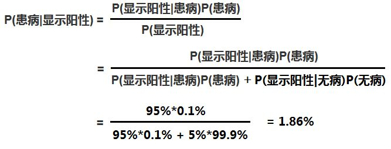
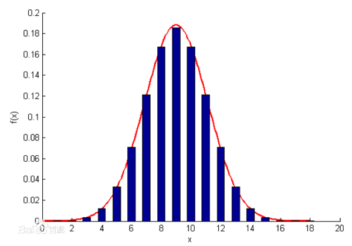
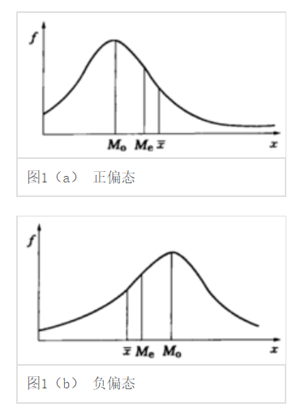
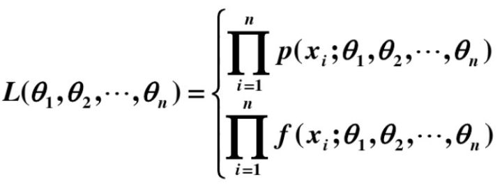
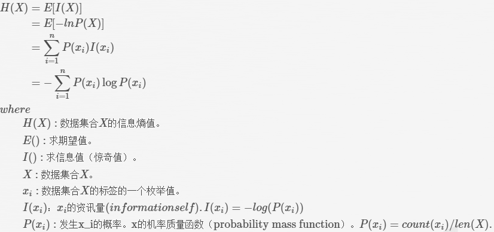

# 最好都能掌握的机器学习数学知识

## 一：概述

学习机器学习和深度学习中，有太多的理论公式推导，没有一定的数学基础是很难理解其意。从另外一个角度上看，数学是机器学习中一个最基础的工具，如果基础都没有打扎实，以后的路将很难走，更别说走远了。
好了，不废话了，请看以下学习清单：

> 事无巨细，我会从某个大方面介绍，其下所包含的额外知识点，请自行脑补，不然这篇文章将会把书籍目录上的知识点都给罗列出来。

## 二：线性代数

### 2.1 标量和向量

标量就是一个数值，不掺杂其它含义。

向量是有大小有方向的量，在这里就是一组有序数，并用以下符号表示：

在实际应用当中，向量通常被当做是高维空间的点，其中每个标量对应具体维度。

### 2.2 矩阵

在介绍矩阵时，我先推荐一款高分视频，这是国外大佬以动画的形式让我们明白，原来线性代数是这个样子的。 [链接](https://space.bilibili.com/88461692?spm_id_from=333.338.v_upinfo.3#/channel/detail?cid=9450)

- 基本运算
    
    对于基本运算，加法、减法、数乘、转置是需要有所了解的。

- 特征值和特征向量

    对于特征值和特征向量，熟悉的人看看公式估计能回忆起来：

        Ax = cx

    ``A``为矩阵，``c`` 为特征值，``x`` 为特征向量。至于计算过程，这不是重点，我接下来要讲的是，特征向量和特征值有什么意义？

    在高维度矩阵中，特征分解可以得到特征值和特征向量，特征值表示的是这个特征到底有多重要，而特征向量表示的是这个特征是什么，可以将每个特征向量理解成一个线性的子空间。[参考链接](http://blog.csdn.net/sunshine_in_moon/article/details/45749691)

    从线性变换的角度来分析，如果矩阵通过变换之后，原向量仍然在变换后的的向量方向上，此方向上的向量就是特征向量。大家可以好好看看[这个](https://www.bilibili.com/video/av6540378?from=search&seid=14733384012190141202)视频，里面很直观的讲解线性变换的几何意义。

    不过，特征分解也有很多局限性，比如说变换的矩阵必须是方阵。

- 线性变换

    通过矩阵基本运算，可以对矩阵进行旋转、拉伸变换，对于三维空间就是翻转，对于更高维度空间，那就自行脑补了~_~~

### 2.3 张量(``tensor``)
看到英文名时应该直接联想到 ``Google`` 的``tensorflow``框架吧。先别急，先看看 ``tensor`` 到底是什么吧。

几何代数中定义的张量是基于向量和矩阵的推广，通俗一点理解的话，我们可以将标量视为零阶张量，矢量视为一阶张量，矩阵就是二阶张量， ``N`` 阶张量就是 ``N`` 维矩阵。

### 2.4 正交分解

特征分解是使用最广的矩阵分解方法之一，

> 矩阵分解是将矩阵拆解为数个矩阵的乘积，可分为三角分解、满秩分解、QR分解、SVD(奇异值)分解等。

### 2.5 奇异值分解(SVD)

奇异值分解（SVD）是在通信系统MIMO、机器学习、图像处理、数据压缩降噪等领域广泛应用的算法。奇异值往往对应着矩阵中隐含的重要信息，且重要性和奇异值大小正相关，每个矩阵A都可以表示为一系列秩为1的“小矩阵”值和，而奇异值则衡量了这些“小矩阵”对于A的权重。公式如下：

[学习视频](https://www.bilibili.com/video/av15971352?from=search&seid=2357140480380449276) \ [知乎参考链接](https://www.zhihu.com/question/22237507)

在图像处理领域，奇异值不仅可以应用在数据压缩上，还可以对图像去噪，如下图带噪点的数据图：

通过奇异值分解，我们发现矩阵的奇异值从大到小分别为：14.15、4.67、3.00、0.21 ......，0.05 。 由于奇异值代表着其代表信息的重要程度，通过观察，这里我们只取前三个奇异值，并用其构造新的矩阵，得到：

奇异值分解还广泛的用于主成分分析(PCA)和推荐系统等。如有看英文文档不费力的各位，可以看看这篇[国外文章](http://www.ams.org/publicoutreach/feature-column/fcarc-svd)

## 三、概率

### 3.1 在人工智能中的地位

概率统计是对不确定性问题的处理手段，也是一种重要的推断手段。

在人工智能领域，我们主要以两种方式来使用概率论。首先，概率法则告诉我们AI系统应该如何推理，所以我们设计一些算法来计算或者近似由概率论导出的表达式。其次，我们可以用概率和统计从理论上分析我们提出的AI系统的行为。

计算机科学的许多分支处理的对象都是完全确定的实体，但机器学习却大量使用概率论。实际上如果你了解机器学习的工作原理你就会觉得这个很正常。因为机器学习大部分时候处理的都是不确定量或随机量。

### 3.2 贝叶斯公式

我们从一个经典例子入手分析贝叶斯公式吧：

假设某种病在人群中的发病率是0.001，即1000人中大概会有1个人得病，则有： P(患病) = 0.1%；即：在没有做检验之前，我们预计的患病率为P(患病)=0.1%，这个就叫作"先验概率"。

再假设现在有一种该病的检测方法，其检测的准确率为95%；即：如果真的得了这种病，该检测法有95%的概率会检测出阳性，但也有5%的概率检测出阴性；或者反过来说，但如果没有得病，采用该方法有95%的概率检测出阴性，但也有5%的概率检测为阳性。用概率条件概率表示即为：P(显示阳性|患病)=95%

现在我们想知道的是：在做完检测显示为阳性后，某人的患病率P(患病|显示阳性)，这个其实就称为"后验概率"。

而这个叫贝叶斯的人其实就是为我们提供了一种可以利用先验概率计算后验概率的方法，我们将其称为“贝叶斯公式”。

这里先了解条件概率公式：

由条件概率可以得到乘法公式：

将条件概率公式和乘法公式结合可以得到：

再由全概率公式：

代入可以得到贝叶斯公式：

此例子中的分析公式就是：

### 3.3 期望、方差、协方差

- 期望

    指在一个离散性随机变量的值乘以其概率的总和，具体公式如下：

    
    
- 方差

    用来衡量随机变量与期望值之间的偏离程度。公式如下：    

    

- 协方差

    用于衡量两个随机变量X和Y之间的总体误差，公式如下：

    

    通俗的理解：两个变量在变化过程中是同方向变化？还是反方向变化？同向或反向程度如何？ 同向变化，协方差为正；反相变化，协方差为负。从数值来看，如果变化程度决定了数值的大小：如果变化趋势一模一样，那么协方差的数值相对较大(同向为正整数，反向为负数)，如果相互独立，不存在任何线性关系，那么最终计算结果将会靠近0。详细了解，可以看看这篇[文章](https://www.zhihu.com/question/20852004)

    所以，协方差也代表着两个随机变量的分布关系，这也是降维分析中的底层概念之一。

    另外，我们来看一下相关系数的概念，公式如下：

    

    就是使用X、Y的方差除以X的标准差和Y的标准差，可以认为是一种特殊的协方差，那就保留着协方差的一些基本性质，不同的就是，相关系数是标准后的协方差，它消除了两个变量变化幅度的影响，而只是单纯反应两个变量每单位变化时的相似程度。

- 协方差矩阵

    上面已经给出协方差的概念，那么协方差矩阵中每一个点，都是都是两个变量所对应的协方差值，而此值就代表着两个变量分布的关系。

    所以协方差矩阵可以判断出多个高维度特征之间的匹配关系，从而对其进行降维分析。在主成分分析中，粗略的来看，先统计数据的协方差矩阵，然后对其做奇异值分解，求出最大奇异值的特征方向。

### 3.4 常见的分布函数

- 高斯分布

    又称为正态分布，为钟型，两头低中间高，左右对称其曲线呈钟型。

    若随机变量X服从一个数学期望为μ、方差为σ^2的正态分布，记为N(μ，σ^2)。其概率密度函数为正态分布的期望值μ决定了其位置，其标准差σ决定了分布的幅度。当μ = 0,σ = 1时的正态分布是标准正态分布。

    

    

    自然界中存在大量的正态分布，比如女性的身高，在我们做数据处理时，就会经常遇到。

    在机器学习有很多应用场景，比如：

    - [高斯朴素贝叶斯](http://sklearn.apachecn.org/cn/0.19.0/modules/generated/sklearn.naive_bayes.GaussianNB.html#sklearn.naive_bayes.GaussianNB)
    - [高斯随机投影](http://sklearn.apachecn.org/cn/0.19.0/modules/generated/sklearn.random_projection.GaussianRandomProjection.html#sklearn.random_projection.GaussianRandomProjection)
    - [高斯混合模型](http://sklearn.apachecn.org/cn/0.19.0/modules/classes.html#module-sklearn.mixture)
    - [高斯处理](http://sklearn.apachecn.org/cn/0.19.0/modules/classes.html#module-sklearn.gaussian_process)

    以上也只是高斯模型的冰山一角，想要对模型进行优化，还是需要深度了解高斯模型。

    另外，扩展一个小知识点：偏态分布；

    

    - M  : 众数
    - Me : 中数
    - x  : 平均值

- 泊松分布和指数分布

    关于这个数据分布，已经有大牛对其做了描述，所以在此我就不多做赘述，直接奉上链接即可：[泊松分布和指数分布：10分钟教程](http://www.ruanyifeng.com/blog/2015/06/poisson-distribution.html)

 
### 3.5 最大似然估计

最大似然也称为最大概似估计，即：在“模型已定，参数θ未知”的情况下，通过观测数据估计未知参数θ 的一种思想或方法。

其基本思想是：  给定样本取值后，该样本最有可能来自参数  为何值的总体。即：寻找  使得观测到样本数据的可能性最大。

求极大似然函数估计值的一般步骤：

- 写出似然函数

    

- 对似然函数取对数
- 两边同时求导数
- 令导数为0解出似然函数方程

在机器学习中，也能经常见到极大似然的影子，比如在计算朴素贝叶斯回归模型、逻辑斯特回归模型(LR)等等，其核心就是构造对数损失函数后运用极大似然估计。

## 4 信息论

信息论本来是通讯中的概念，但是其核心概念“熵”在机器学习中得到了广泛的应用，比如决策树模型ID3，C4.5中是利用信息增益来划分特征而生成一颗决策树的，而信息增益就是基于这里所说的熵。所以它的重要性也是可想而知。

### 4.1 熵

在信息论中，熵是接收的每条消息中包含的信息的平均值，又被称为信息熵。

熵被定义为信息的期望值，也是对随机变量的比特量和顺次发生概率相乘在总和的数学期望。

- 特征
    - 发生概率小的信息，熵值越大
    - 常识的熵为0
    - 从计算损失的角度来讲：熵越大，说明损失越大

- 信息熵的计算公式

    

- 熵的作用

    - 计算损失(loss function)

        用于调整梯度递减的步长。

    - 决策树

        熵越大，说明特征的划分数据能力越强

### 4.2 相对熵

***

- [参考资料一](https://www.cnblogs.com/steven-yang/p/6348112.html)
- [参考资料二](https://zhuanlan.zhihu.com/p/25197792)
